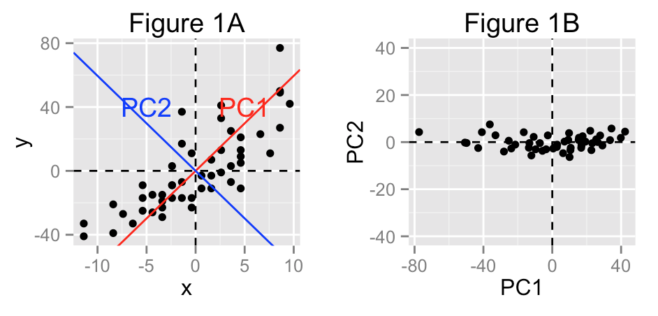

# Outline

## What you'll learn today

* Comparison between supervised with unsupervised learning
* Principal Component Analysis

## Training Objective

.png)

# Supervised vs Unsupervised Learning

---

What makes unsupervised learning different from supervised learning?

Can you spot the difference based on this picture?

## Dimensionality Reduction

From 32x32 pixels (1024 dimensions) to just 50 dimensions

## The goal of PCA

**To explain most of the variability in the data with a smaller number of variables than the original data set**

## How does PCA works?

Reduce the complexity of model by remove the redundant dimensions from data

## Result: a More Valuable Data

Some people have likened unsupervised learning to an **exploratory process** of the data, which there are:

- No target variable
- No model building & assumption
- No model evaluation
- Focus on **understanding pattern in a data** to identify opportunities for **dimensionality reduction** or for **clustering**

---

**Let's go to `inclass.rmd` !** `r emo::ji("smile")`
